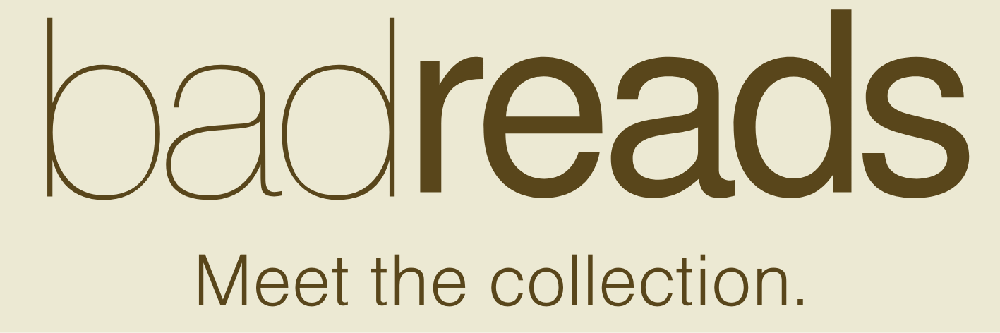

# BadReads
 ### [BadReads](https://aa-bad-reads.herokuapp.com/) is a full-stack goodreads clone with a literary twist.

 <!--  -->

#### Find and read the top banned books of yesterday and today; keep track of banned books you want to read and be part of the world's largest community of banned book lovers on badreads.
 >A banned book is a book that has been removed from school curriculums and/or public libraries because a person or group has objected to its content.

## Technologies used
* Python
* Javascript
* Flask
* React
* Redux
* SQLAlchemy
* Alembic

## How to run app locally
* Run "git clone" with the copy/pasted repo link in whatever directory you want the clone to live.
* Open the repo locally on the IDE of your choice and cd into the root directory.
* Run `pipenv install -r requirements.txt` to isntall dependencies.
* Run `pipenv shell`.
* Run `flask db upgrade`.
* Run `flask seed all`.
* Run ` flask run` to start the backend.
* In a new terminal, cd into the "react-app" directory and run `npm install`
* Then run `npm start` to start the frontend.
* Congrats! The app should now be running locally.

## WikiLinks
* [API Routes](https://github.com/ARGON90/BadReads/wiki/API-Routes)
* [Database Schema](https://github.com/ARGON90/BadReads/wiki/Database-Schema)
* [Feature List](https://github.com/ARGON90/BadReads/wiki/Feature-List)
* [User-Facing Routes](https://github.com/ARGON90/BadReads/wiki/User-Facing-Routes)
* [User Stories](https://github.com/ARGON90/BadReads/wiki/User-Stories)
* [Wirefram Inspiration](https://github.com/ARGON90/BadReads/wiki/Wireframe-Inspo)

## Feature Walkthrough

### Splash Page
* You can log in as a demo user in order to interact with the site easily by clicking the "login with demo user" button.
* If you have already created an account, you can sign in.

### Home Page
* You can view all of the banned books on the home page. Click the My Books button in the nav bar to begin creating a new banned book.

### My Books Page
* Click the "Add a book" button to begin creating a book! Enter the proper information (including a valid image url) and click submit to create the book.
* The new book will appear at the top of the page, click on it in order to navigate to the book-specific page and review it.

### Book-by-id Page
* Here you can click the "Write a review" button in order to make a new review for this book. Enter the proper information and click "Create Review" to save it!
* Now, you can click on the "Add to Bookshelf" button to assign this book to one of your default bookshelves.
* Click the book icon in the nav bar, or click the profile icon and then "Bookshelves" in the dropdown to navigate to the bookshelves page.

### Bookshelves Page
* If you check the default shelf you added the book to, it should be there!
* Click the "Add shelf" button on the bottom left of the screen to add a custom bookshelf.
* Click on the "All" shelf on the left of the screen, and then click the edit button above your created book in order to add it to your newly created bookshelf.
* You have now explored the basic functionality of the BadReads site - feel free to edit/delete/create whatever else you want!\

